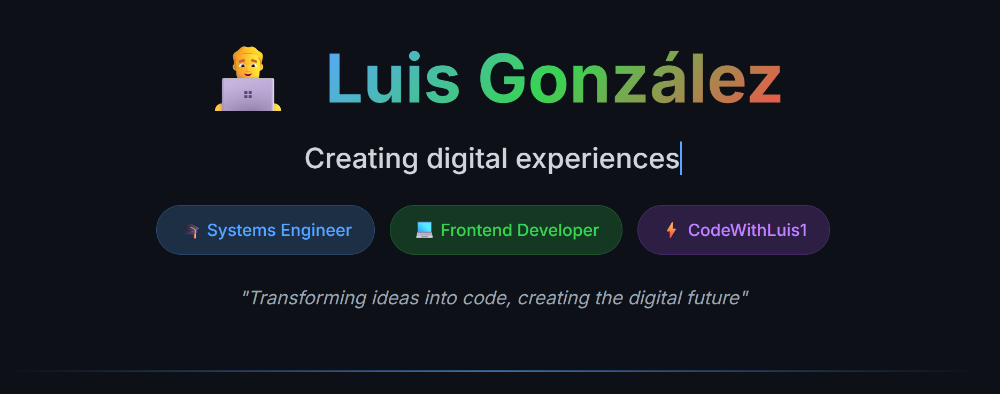

## 🚀 About Me

I am a technology and software development professional passionate about designing and building modern, efficient, and scalable frontend solutions.  

My commitment is to always deliver the best technical quality, working with clean methodologies, development best practices, and a continuous improvement mindset.

💡 **I stand out for:**
- Analytical ability and complex problem-solving skills
- Adaptability to new technologies and work environments  
- Results-oriented approach and process improvement focus
- Collaborative teamwork and effective communication in multidisciplinary teams

📚 **English Level:** **B2 (Upper-Intermediate)**

---

## 🧰 Main Technologies & Tools


---

## 📈 GitHub Stats

<div align="center">


</div>

---

## 🏆 GitHub Trophies

<div align="center">


</div>

---

## 💻 Activity Graph


---

## 📊 Profile Views & Followers

<div align="center">


[](https://github.com/CodeWithLuis1)

</div>

---

## 🎯 Current Focus

```javascript
const currentGoals = {
    learning: ["Advanced React Patterns", "Next.js 14", "Web3 Development"],
    building: ["Personal Portfolio", "E-commerce Platform", "Task Management App"],
    exploring: ["AI/ML Integration", "Mobile Development", "DevOps Practices"],
    goal: "Becoming a Full-Stack Engineer"
};
```

---

## 🤝 Let's Connect

<div align="center">

[](https://linkedin.com/in/your-profile)
[](https://your-portfolio.com)
[](mailto:your-email@gmail.com)
[](https://twitter.com/your-handle)

</div>

---

## 📫 Contact Information

✉️ **Email:** your-email@gmail.com  
💼 **LinkedIn:** [LinkedIn Profile](https://linkedin.com/in/your-profile)  
🌐 **Portfolio:** [Portfolio Website](https://your-portfolio.com)  
📱 **Location:** Guatemala City, Guatemala

---

<div align="center">

### 💡 *"Passion for technology is not just a job, it's a lifestyle."* 🚀

**Thank you for visiting my profile! Feel free to explore my repositories and don't hesitate to reach out for collaboration opportunities.**


---

⭐ **If you like my work, please consider giving a star to my repositories!** ⭐

</div>